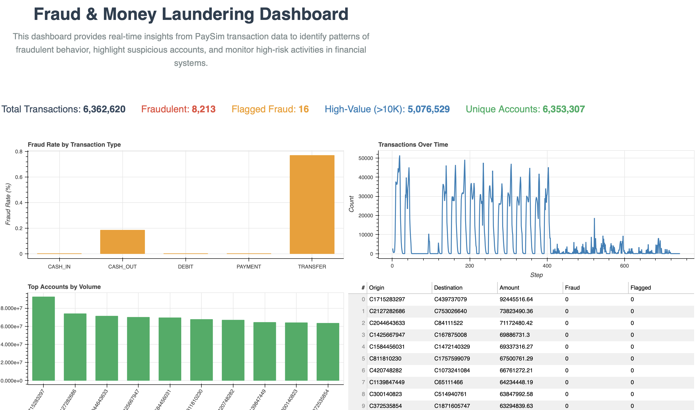

# 🏦 Fraud & Money Laundering Detection Dashboard

This project showcases a **Banking Fraud and Money Laundering Detection Dashboard** built with **Python, Bokeh, SQLAlchemy, and Pandas**, using the **PaySim Kaggle dataset** (synthetic financial transactions).

The dashboard provides real-time insights into banking transactions, highlighting fraudulent patterns, unusual activities, and key metrics.

---

## 📊 Key Features

✅ **KPIs at a Glance**  
- Total Transactions  
- Fraudulent Transactions  
- Flagged Fraud  
- High-Value Transactions (> $10K)  
- Unique Accounts

✅ **Visual Insights**  
- Fraud Rate by Transaction Type (Bar Chart)  
- Transactions Over Time (Line Chart)  
- Top Accounts by Transaction Volume (Bar Chart)

✅ **Investigative Insights**  
- High-Value Transactions Table  
- Unusual Clients (High-Activity Accounts)

✅ **Interactive Bokeh Dashboard**  
- Responsive layout  
- Clean, professional design  
- Real-time data from SQLite database

---

## 📂 Dataset

- **Source**: [PaySim Dataset on Kaggle](https://www.kaggle.com/datasets/ealaxi/paysim1)
- Synthetic financial transaction data simulating mobile money transactions.
- Includes transaction types, amounts, balances, and fraud labels.

---

## 🏗️ Tech Stack

- **Python** (Pandas, SQLAlchemy)
- **Bokeh** for interactive visualization
- **SQLite** for local data storage
- **PaySim CSV** as data source

---

## ⚙️ Setup Instructions

### 1️⃣ Clone the Repository

```bash
git clone https://github.com/your-username/Banking-Transaction-Analytics.git
cd Banking-Transaction-Analytics
```

### 2️⃣ Install Dependencies
Create a virtual environment (optional but recommended):

```bash
python -m venv venv
source venv/bin/activate
```

Install required packages:
```bash
pip install -r requirements.txt
```

### 3️⃣ Prepare the Data
Download the PaySim dataset from [Kaggle](https://www.kaggle.com/datasets/ealaxi/paysim1) and place it in the `data/raw/` folder.

Run the data loading script:
```bash
python load_data.py
```

This will create a banking.db SQLite database from the PaySim CSV file.

### 4️⃣ Launch the Dashboard
Run the Bokeh server:
```bash
cd dashboard
bokeh serve --show app.py
```
Your interactive dashboard will open in the browser at:
```bash
http://localhost:5006/app
```

## 🖼️ Dashboard Preview



## 💡 Insights You Can Explore
- Which transaction types have the highest fraud rate?
- How do transactions fluctuate over time?
- Who are the top transacting clients?
- Are there accounts showing unusually high activity or amounts?


## 🙌 Acknowledgements
[Kaggle PaySim Dataset](https://www.kaggle.com/datasets/ealaxi/paysim1)


## 📧 Contact
For questions, reach out via [LinkedIn](https://www.linkedin.com/in/venkateshtantravahi) or open an issue on GitHub.